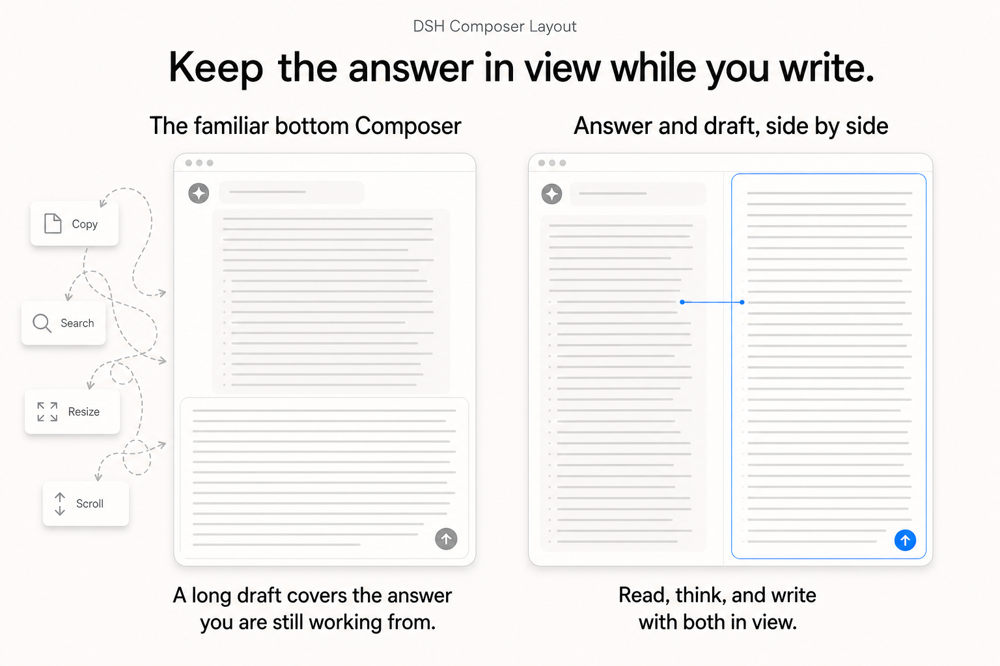
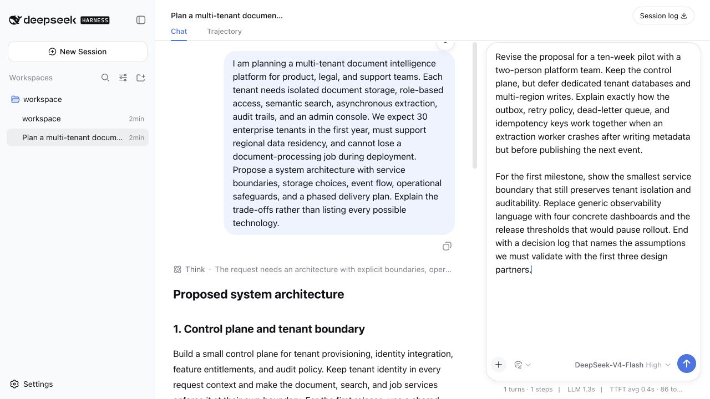

# DSH Composer Layout

**English** · [简体中文](README.zh.md)

[](https://github.com/topics/dsh-plugin)
[](LICENSE)

> **Keep the answer in view while you write.** Dock Composer to the right so the answer and your growing draft can stay side by side.

[DeepSeek Harness](https://github.com/deepseek-ai/deepseek-harness) Web plugin that lets the Composer stay at the bottom or dock in a right-side column. The chat and Composer keep their own space, while the normal DSH model, permission, quota, session, and tool behavior remains intact.



## Why a side-by-side Composer?

The familiar bottom Composer works well when both the answer and the next message are short. Once either one grows, they have to compete for the same vertical strip: a long answer pushes the input away, while a long draft hides the material it is supposed to reference. The work then turns into compensation—copy a detail out, resize the input, scroll back to recover context, search for the passage just read, and repeat.

This is especially wasteful on a desktop. Most desktop displays are wide; horizontal room is usually available, while the height shared by a growing answer, a growing draft, and browser chrome is scarce. A vertical layout spends the abundant dimension poorly and makes the constrained one do all the work.

Docking Composer to the right gives reading and writing separate vertical space. The conversation can stay visible as it grows; the draft can become as detailed as the task requires. The important change is simultaneous access: read a passage, think through it, and shape the corresponding part of the next prompt without losing either surface. It is a small layout change that removes a recurring interruption from long-form work.

## See it in DSH



## What it adds

- Bottom and right-side Composer placement from **Settings → Plugins → Composer Layout**.
- A visible docking handle; in the right layout it also resizes the Composer pane.
- Per-session placement and manually resized right-pane width when “Remember this session layout” is enabled.
- Narrow-window positioning for slash commands, model/access/context menus, and quota panels.

The plugin is presentation-only: it does not add model-facing tools, change prompts, or alter token accounting.

## Install

### Install from npm

Once published, npm installs use the same prebuilt package as the GitHub release:

```sh
dsh plugin --profile web add dsh-composer-layout@0.1.3
dsh web --profile web
```

### Install directly from GitHub

DSH installs the plugin bundle directly from a GitHub repository; pinning the command to `v0.1.3` makes the installed source explicit and repeatable.

```sh
dsh plugin --profile web add "github:lavapapa/dsh-composer-layout#v0.1.3"
dsh web --profile web
```

Then open **Settings → Plugins → Composer Layout** and select **Right side**. Restarting the Web profile is required because DSH does not hot-reload profile patches.

The repository ships the prebuilt host and browser artifacts used by this command, so installation does not need an install-time build step. To confirm that DSH added the bundle to the intended profile:

```sh
dsh --profile web --dump-config
```

### Release asset and updates

The GitHub Release also contains a `.tgz` package for an offline or inspected install:

```sh
dsh plugin --profile web add /path/to/dsh-composer-layout-0.1.3.tgz
dsh web --profile web
```

For a later version, remove the installed package, then add the new npm version, tag, or release asset:

```sh
dsh plugin --profile web remove dsh-composer-layout
dsh plugin --profile web add dsh-composer-layout@0.1.3
# or: dsh plugin --profile web add "github:lavapapa/dsh-composer-layout#v0.1.3"
dsh web --profile web
```

The plugin requires a DSH Web build whose `@deepseek-ai/dsh-*` packages are in the `0.1.x` prerelease line; the tested source checkout is recorded in the release notes.

## Development

The repository intentionally commits the generated `lib/` artifacts used by GitHub installs. The source is under `src/`; the source-of-record implementation lives in the DSH workspace and is kept here so a release can be reviewed without opening the monorepo. Changes that touch DSH internals should be tested against the matching DSH checkout before publishing a new release.

## Related links

- [DeepSeek Harness](https://github.com/deepseek-ai/deepseek-harness)
- [DSH plugin topic](https://github.com/topics/dsh-plugin)
- [Awesome DSH Plugin](https://github.com/awesome-dsh-plugin/awesome-dsh-plugin)
- [DSH Market](https://github.com/dsh-market/dsh-market)

## License

MIT. See [`LICENSE`](LICENSE).
