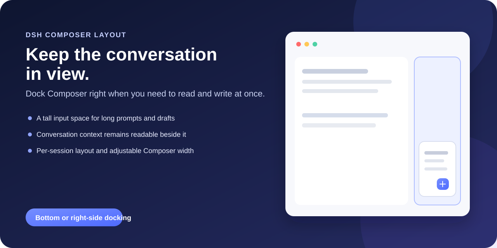
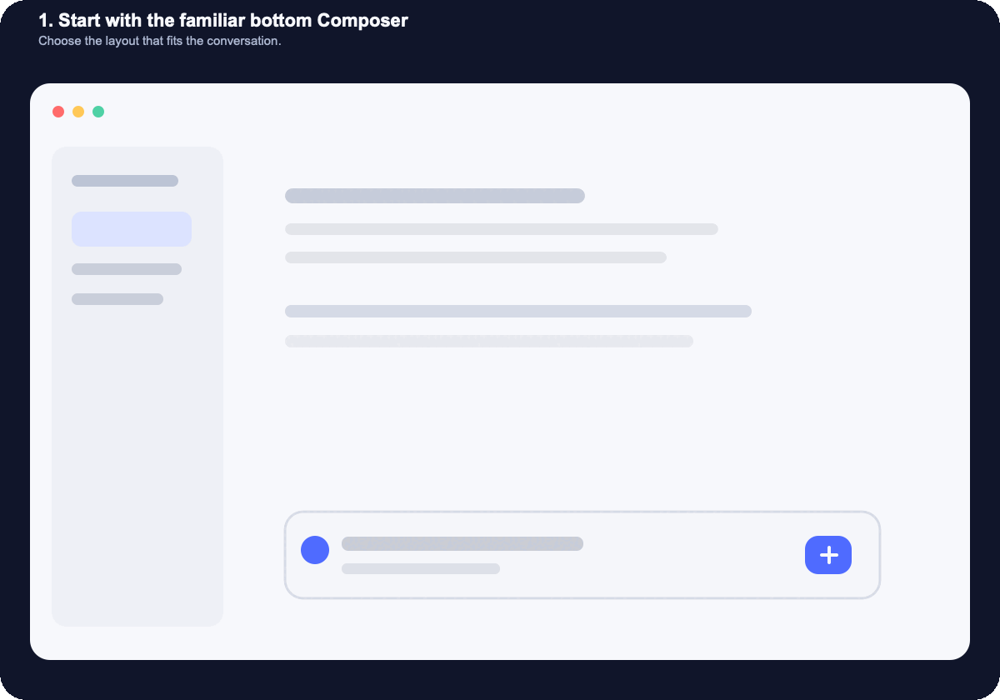

# DSH Composer Layout

[English](README.md) · **简体中文**

[](https://github.com/topics/dsh-plugin)
[](LICENSE)

> **阅读留在这里，输入放到旁边。** 当一段长输入需要不断对照对话、资料或日志时，把 Composer 停靠到右侧。

这是一个可选的 [DeepSeek Harness](https://github.com/deepseek-ai/deepseek-harness) Web 插件，让 Composer 保持在底部，或停靠到右侧栏。聊天区与 Composer 各自保留空间；模型、权限、额度、会话和工具行为继续使用 DSH 原有实现。





这段动图展示了操作思路：先从熟悉的底部输入栏开始；输入变长时停靠到右侧；随后在右栏中使用菜单，不丢失 Composer 本身。实际界面仍运行在 DSH Web 页面中。

## 为什么要把 Composer 放在右侧？

上下布局适合短对话。右侧布局服务于“写作和参考同时发生”的场景：撰写较长的指令、对照前文修改答案、参考代码或日志、组织多步骤任务。它让输入区拥有独立的纵向空间，同时把对话留在旁边；草稿增长时，正在参考的内容不会被向上挤出视野。

## 它增加了什么

- 在“**设置 → 插件 → Composer 布局**”中选择底部或右侧布局。
- 提供可见的停靠手柄；右侧布局下，分隔条也可以调整 Composer 栏宽度。
- 打开“记住当前会话布局”后，分别保存每个会话的布局，以及手动调整过的右侧栏宽度。
- 在窄窗口中重新安排斜杠命令、模型／权限／上下文菜单和额度面板的位置。
- 左右布局里，打开其他 Composer 弹出面板前会先收起命令菜单；上下布局继续保持 DSH 的原生行为。
- 插件图标位于 [`assets/icon.svg`](assets/icon.svg)，尺寸为 512×512。

本插件只负责界面布局，不新增面向模型的工具，不改变提示词或额度统计。

## 安装

### 最快路径：直接从 GitHub 安装

首个版本不依赖 npm。DSH 可以直接从 GitHub 仓库安装插件 bundle；命令固定到 `v0.1.0`，因此每次安装的来源和版本都清楚可追溯。

```sh
dsh plugin --profile web add "github:lavapapa/dsh-composer-layout#v0.1.0"
dsh web --profile web
```

然后打开“**设置 → 插件 → Composer 布局**”，选择“**右侧**”。DSH 不会热重载 profile patch，安装后需要重启 Web profile。

仓库已经提交 GitHub 安装所需的 Host 与浏览器产物，安装过程不需要额外执行构建。可以用下面的命令确认 bundle 已写入目标 profile：

```sh
dsh --profile web --dump-config
```

### Release 安装包与更新

GitHub Release 也会提供 `.tgz` 安装包，适合无法直接访问 GitHub、或希望先检查包内容的情况：

```sh
dsh plugin --profile web add /path/to/dsh-composer-layout-0.1.0.tgz
dsh web --profile web
```

更新到后续版本时，先移除当前插件，再改用新的 tag 或 Release 安装包：

```sh
dsh plugin --profile web remove dsh-composer-layout
dsh plugin --profile web add "github:lavapapa/dsh-composer-layout#v0.1.0"
dsh web --profile web
```

插件需要 DSH Web 的 `@deepseek-ai/dsh-*` 依赖处于 `0.1.x` 预发布系列；发布说明会记录实际测试所用的源码提交。

## 设置与行为

打开“**设置 → 插件 → Composer 布局**”选择默认位置。开启会话记忆后，每个会话拥有自己的布局；新建或切换到没有覆盖值的会话时，会从设置里的默认位置开始。关闭会话记忆后，设置中的默认位置重新对所有会话生效。

右侧布局会为 Composer 保留最小宽度，并通过视口感知的 portal 放置菜单和额度详情。窗口变窄时，左侧栏仍以 DSH 自己的阈值为准；插件不会另起一套左侧栏阈值。

## 兼容性与边界

这是一个只面向 Web 的 bundle，需要标准 DSH Web profile；它不提供服务器、桌面壳、TUI 或模型提供方。卸载命令：

```sh
dsh plugin --profile web remove dsh-composer-layout
```

第三方 DSH 插件会以本地 DSH 进程的权限运行。通过 GitHub 安装前，请先阅读源码，并固定到 release 或 commit。

## 开发

仓库有意提交了 GitHub 安装需要的 `lib/` 构建产物。源码位于 `src/`；实现源头在 DSH workspace 中，这里保留对应代码，方便在不打开 monorepo 的情况下审阅一次发布内容。涉及 DSH 内部接口的改动，应先在匹配的 DSH checkout 中完成测试，再发布新版本。

## 相关链接

- [DeepSeek Harness](https://github.com/deepseek-ai/deepseek-harness)
- [DSH 插件主题](https://github.com/topics/dsh-plugin)
- [Awesome DSH Plugin](https://github.com/awesome-dsh-plugin/awesome-dsh-plugin)
- [DSH Market](https://github.com/dsh-market/dsh-market)

## 许可证

MIT，详见 [`LICENSE`](LICENSE)。
