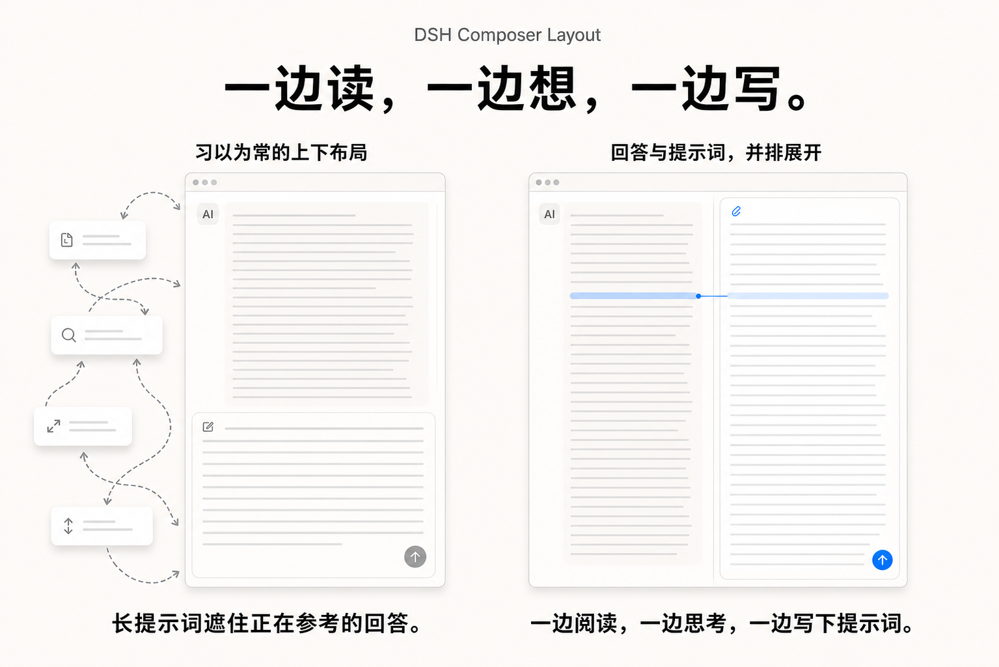

# DSH Composer Layout

[English](README.md) · **简体中文**

[](https://github.com/topics/dsh-plugin)
[](LICENSE)

> **一边读，一边想，一边写。** 把 Composer 停到右侧，让回答和正在成形的提示词始终并排可见。

这是一个 [DeepSeek Harness](https://github.com/deepseek-ai/deepseek-harness) Web 插件，让 Composer 保持在底部，或停靠到右侧栏。聊天区与 Composer 各自保留空间；模型、权限、额度、会话和工具行为继续使用 DSH 原有实现。



## 为什么要把 Composer 放在右侧？

大家已经习惯了上下布局，它也确实适合回答和输入都很短的对话。但只要回答变长，或者要写一段真正复杂的指令，回答和输入就会争夺同一段纵向空间：长回答会把输入区挤远，长草稿又会把正在参考的内容推走。接下来往往只能靠补救：复制一段内容、调整输入区、向上滚回去找上下文、搜索刚刚看过的段落，然后再重复一次。

这在桌面端尤其可惜。大多数桌面显示器天生更宽，横向空间往往仍有余量；浏览器界面、不断增长的回答和草稿却只能挤在有限的纵向高度里。上下布局没有用好相对充裕的横向空间，反而把最紧张的纵向空间消耗得更快。

把 Composer 放到右侧以后，阅读和写作各自拥有稳定的纵向空间。对话再长，仍可留在左边；草稿再复杂，也能在右边展开。关键在于两者能同时留在视野里：读到一段内容，顺着它思考，就在旁边写下或修订相应的提示词，不必先丢失其中一边再找回来。这只是一个布局调整，却能消除长输入工作中反复被打断的感觉。

## 实际界面


## 它增加了什么

- 在“**设置 → 插件 → Composer 布局**”中选择底部或右侧布局。
- 提供可见的停靠手柄；右侧布局下，分隔条也可以调整 Composer 栏宽度。
- 打开“记住当前会话布局”后，分别保存每个会话的布局，以及手动调整过的右侧栏宽度。
- 窗口装不下两个可用栏位时，暂时回到上下布局，同时保留布局手柄；宽度恢复后，记住的右侧布局会自动回来。
- 右侧布局中，打开模型、权限、上下文等 Composer 面板前会收起斜杠／引用候选，避免浮层互相遮挡。

本插件只负责界面布局，不新增面向模型的工具，不改变提示词或额度统计。

## 安装

### 从 npm 安装

发布到 npm 后，可直接安装与 GitHub Release 相同的预构建包：

```sh
dsh plugin --profile web add dsh-composer-layout@0.1.6
dsh web --profile web
```

### 直接从 GitHub 安装

DSH 可以直接从 GitHub 仓库安装插件 bundle；命令固定到 `v0.1.6`，因此每次安装的来源和版本都清楚可追溯。

```sh
dsh plugin --profile web add "github:lavapapa/dsh-composer-layout#v0.1.6"
dsh web --profile web
```

然后打开“**设置 → 插件 → Composer 布局**”，选择“**右侧**”。DSH 不会热重载 profile patch，安装后需要重启 Web profile。

仓库已经提交 GitHub 安装所需的 Host 与浏览器产物，安装过程不需要额外执行构建。可以用下面的命令确认 bundle 已写入目标 profile：

```sh
dsh --profile web --dump-config
```

### Release 安装包与更新

GitHub Release 也会提供 `.tgz` 安装包，适合无法直接访问 GitHub、或希望先检查包内容的情况：

```sh
dsh plugin --profile web add /path/to/dsh-composer-layout-0.1.6.tgz
dsh web --profile web
```

更新到后续版本时，先移除当前插件，再改用新的 npm 版本、tag 或 Release 安装包：

```sh
dsh plugin --profile web remove dsh-composer-layout
dsh plugin --profile web add dsh-composer-layout@0.1.6
# 或：dsh plugin --profile web add "github:lavapapa/dsh-composer-layout#v0.1.6"
dsh web --profile web
```

插件需要 DSH Web 的 `0.1.0-rc.8` 依赖版本；0.1.6 已在 DSH Web `0.1.1-rc.2` 中完成构建和界面检查。

## 开发

仓库有意提交了 GitHub 安装需要的 `lib/` 构建产物，插件实现由本仓库 `src/` 自己维护。发布前运行 `pnpm typecheck`、`pnpm build` 和 `pnpm test`，并在匹配版本的干净 DSH checkout 中做一次实际检查。

## 相关链接

- [DeepSeek Harness](https://github.com/deepseek-ai/deepseek-harness)
- [DSH 插件主题](https://github.com/topics/dsh-plugin)
- [Awesome DSH Plugin](https://github.com/awesome-dsh-plugin/awesome-dsh-plugin)
- [DSH Market](https://github.com/dsh-market/dsh-market)

## 许可证

MIT，详见 [`LICENSE`](LICENSE)。
